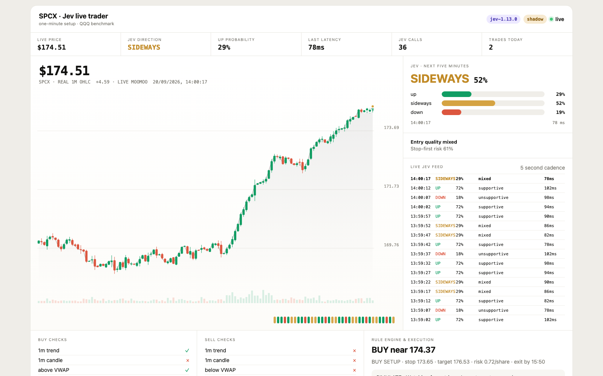

# Moomoo Jev Trader

A live, long-only US equities trading dashboard that combines **Moomoo OpenD market data and order execution** with **TypeSafe Jev probabilistic market reviews**.

The application reads real one-minute OHLCV candles and live quotes from Moomoo, evaluates a deterministic seven-factor setup, asks Jev for an independent typed assessment every five seconds, and can route approved entries to Moomoo's simulated or live trading environment.

> [!WARNING]
> Experimental software—not financial advice. Start with Moomoo's `SIMULATE` environment and Jev `shadow` mode. No model probability demonstrates a profitable trading edge.

## Dashboard preview



*Preview captured with deterministic synthetic candles and simulated execution to showcase the interface without exposing brokerage data.*

## Inspiration

This project was inspired by [jarrodwatts/jev-trader](https://github.com/jarrodwatts/jev-trader), which demonstrates fast TypeSafe Jev decisions against a live crypto order book. Moomoo Jev Trader adapts that idea to US equities with:

- Real Moomoo OpenD quotes and one-minute candles
- A responsive live candlestick and volume dashboard
- Moomoo simulated and live order execution
- Deterministic position sizing, stops, targets, and daily risk limits
- Jev shadow evaluation before optional confidence-gated execution

This is an independent project and is not affiliated with the original repository, Moomoo, or TypeSafe AI.

## Live dashboard

The browser dashboard updates continuously and shows:

- Real one-minute OHLC candlesticks and volume from Moomoo
- Current exchange quote with stale/closed-market detection
- Jev `up`, `sideways`, and `down` probabilities
- Jev entry-quality and stop-first-risk evaluations
- A five-second decision feed and chart markers
- Deterministic buy/sell checks
- Current order, position, fills, daily P&L, and kill switch

The chart never fabricates ticks: completed candles come directly from Moomoo and the active candle comes from OpenD. Feed, Jev, and broker errors are shown in the page header and execution line instead of being hidden behind stale numbers.

## Architecture

```text
Moomoo OpenD
  ├─ live quote every 2 seconds ───────────────┐
  └─ completed 1m OHLCV + benchmark ──┐       │
                                      ▼       ▼
                               deterministic setup
                                      │
                         ┌────────────┴────────────┐
                         ▼                         ▼
                TypeSafe Jev review          risk engine
                    every 5 seconds               │
                         │                         │
                    shadow/enforce ────────────────┤
                                                   ▼
                                      Moomoo simulated/live broker
```

Jev does not size positions, place orders, or manage exits. Those operations remain explicit Python logic.

## Requirements

- macOS, Windows, or Linux with Python 3.10+
- A Moomoo account with [OpenD](https://openapi.moomoo.com/moomoo-api-doc/en/quick/opend-base.html) installed and logged in
- A [TypeSafe API key](https://console.typesafe.ai/keys)
- Access to Moomoo OpenAPI market data for the selected symbols

## Set up Moomoo OpenAPI and OpenD

OpenD is Moomoo's local gateway. This application connects to OpenD over TCP; it never logs directly into Moomoo itself.

1. **Create and fund or enable a Moomoo account.** Available markets, real-time quote entitlements, simulated trading, and live OpenAPI trading vary by region and account.
2. **Download OpenD** from Moomoo's [OpenAPI downloads page](https://www.moomoo.com/download/OpenAPI). Choose either the graphical OpenD application or Command Line OpenD for your operating system.
3. **Start OpenD and log in.** Follow the prompts for your Moomoo ID, password, and verification code. Keep OpenD running while this project runs.
4. **Confirm the gateway address.** The normal local endpoint is `127.0.0.1:11111`. In OpenD settings, ensure the API listening address and port match `MOOMOO_HOST` and `MOOMOO_PORT` in this project's `.env`.
5. **Unlock trading when required.** Quote access does not require trade unlocking, but simulated or live order submission may require the trading password to be unlocked in OpenD. Use Moomoo's OpenD interface and follow the rules for your region; never put the trading password in this repository.
6. **Verify quote permissions.** Subscribe to the symbol in Moomoo and confirm your account has US quote rights. Delayed or unavailable entitlements will affect the dashboard and strategy.

Useful official references:

- [OpenD introduction](https://openapi.moomoo.com/moomoo-api-doc/en/quick/opend-base.html)
- [OpenAPI quick start](https://openapi.moomoo.com/moomoo-api-doc/en/quick/started.html)
- [Python API documentation](https://openapi.moomoo.com/moomoo-api-doc/en/)

Moomoo rate-limits its trade queries (about ten account or order queries per 30 seconds). The executor asks Jev before it reads the account, reads the account only when a new entry is possible, and re-reads an open order every four seconds. A failed OpenD query is shown on the dashboard as a broker error and retried on the next pass rather than stopping risk management. A failed order *placement* is never simply re-sent: OpenD's client gives up after 12 seconds even when the order was accepted, so the executor notes every order the broker already lists before it sends one, then adopts only an order that appeared afterwards, re-sends a sell only when the broker still shows every tracked share, and skips an entry it cannot find. A start-up query that fails is retried with the error on the dashboard instead of leaving the account unmanaged, and an answer OpenD gives in a shape the connector cannot read is treated the same way as a failed query. Any other failure inside the executor is logged with its traceback, shown on the dashboard, and retried on the next pass, so the kill switch and the cutoff exit keep working.

### Optional macOS command-line launcher

After downloading Command Line OpenD, set its directory only in your local `.env`:

```env
OPEND_DIR=/absolute/path/to/the/folder/containing/OpenD.app
```

First login:

```bash
./opend.sh
```

After OpenD has remembered the login:

```bash
./opend.sh daemon
```

The graphical Moomoo OpenD application works as well and does not require `OPEND_DIR`.

## Set up TypeSafe Jev

Jev is TypeSafe's System One model. This project sends it one request every five seconds while fresh market data is available and receives typed probabilities back; it never places or sizes orders.

1. **Create an account and an API key** at [console.typesafe.ai](https://console.typesafe.ai) under [Keys](https://console.typesafe.ai/keys).
2. **Put the key in `.env`** as `TYPESAFE_API_KEY=...`. Without a key the dashboard still runs; the Jev panel reports `disabled` and, in `enforce` mode, every entry is refused because there is no review to pass.
3. **Choose the model and timeout.** `JEV_MODEL` defaults to `jev-latest`; any Jev model id from the TypeSafe console works. `JEV_TIMEOUT_SECONDS` (default 4) is the HTTP timeout for each request so a slow response cannot stall the five-second cadence; requests are not retried, the next tick simply asks again.
4. **Know the cadence and cost.** One request every five seconds is 720 requests per hour and roughly 4,700 per regular US session. Jev pauses when the exchange quote is older than `JEV_MAX_QUOTE_AGE_SECONDS`, so nothing is spent while the market is closed. Check TypeSafe's current pricing before leaving the app running all day.
5. **Start in shadow mode.** `JEV_ENTRY_GATE_MODE=shadow` shows and journals every review without touching orders. Completed reviews are appended to `logs/jev_reviews.jsonl`, one JSON object per line with the candle, live price, the three answers, and the `approved` verdict, so you can compare them with what the market did next.
6. **Switch to enforce deliberately.** Set `JEV_ENTRY_GATE_MODE=enforce` once the shadow log looks right. A fresh review of the same completed candle must satisfy `JEV_MIN_UP_PROBABILITY`, `JEV_MIN_QUALITY_PROBABILITY`, and `JEV_MAX_STOP_FIRST_PROBABILITY`; a review older than `JEV_MAX_GATE_AGE_SECONDS`, a failed request, or a missing key fails closed. Any value other than `shadow` or `enforce` refuses to start.

## Installation

```bash
git clone https://github.com/maxlibin/moomoo-jev-trader.git
cd moomoo-jev-trader
python -m venv .venv
source .venv/bin/activate
python -m pip install -r requirements.txt
```

On Windows, activate the environment with `.venv\Scripts\activate`.

Create and configure your private environment file:

```bash
cp .env.example .env
```

`.env` is intentionally ignored by Git. **Never commit it.** It contains API credentials and machine-specific paths.

```env
TYPESAFE_API_KEY=your_key
WATCH_SYMBOL=SPCX
WATCH_BENCHMARK=QQQ
MOOMOO_HOST=127.0.0.1
MOOMOO_PORT=11111

# Safe defaults
AUTO_TRADE=false
MOOMOO_TRADE_ENV=SIMULATE
JEV_ENTRY_GATE_MODE=shadow
```

Before starting the app, verify that OpenD is listening:

```bash
# macOS/Linux
nc -zv 127.0.0.1 11111
```

Then run:

```bash
python run_live.py
```

Open [http://127.0.0.1:8050](http://127.0.0.1:8050). The application also attempts to open the page automatically.

On macOS, `./opend.sh` can launch a command-line OpenD installation after `OPEND_DIR` is configured in `.env`.

## Trading modes

### Watch only

```env
AUTO_TRADE=false
JEV_ENTRY_GATE_MODE=shadow
```

No broker orders are submitted.

### Simulated execution

```env
AUTO_TRADE=true
MOOMOO_TRADE_ENV=SIMULATE
JEV_ENTRY_GATE_MODE=shadow
```

The deterministic strategy can place simulated orders. Jev results are displayed and journaled but do not affect entries.

### Enforced Jev gate

```env
AUTO_TRADE=true
MOOMOO_TRADE_ENV=SIMULATE
JEV_ENTRY_GATE_MODE=enforce
```

A fresh Jev review for the same completed candle must satisfy all configured thresholds before entry. Missing, failed, or stale Jev results fail closed. Validate shadow results before enabling this mode.

### Live execution

Set `MOOMOO_TRADE_ENV=REAL` only after reviewing your regional Moomoo permissions, broker behavior, fees, and the code. Live trading can lose money.

## Jev questions

A single parallel System One request evaluates:

- `direction`: up, sideways, or down over the next five minutes
- `entry_quality`: supportive, mixed, or unsupportive for the proposed long
- `stop_first`: probability that downside or failed-breakout risk is elevated

Completed reviews are written to `logs/jev_reviews.jsonl` for offline outcome analysis. Jev pauses when the exchange quote is stale instead of repeatedly evaluating closed-market data.

## Risk controls

The executor is long-only and includes:

- Risk-based whole-share sizing
- Maximum position allocation
- Maximum trades per day
- Daily loss limit
- Limit-entry timeout
- Fee-aware minimum expected gain
- Stop, target, and end-of-session exits; the cutoff exit fires even while the quote feed is down
- No entry, stop, or target acts on a quote whose exchange stamp is older than `MAX_QUOTE_AGE_SECONDS` or more than two seconds ahead of the clock, so delayed entitlements, an OpenD gateway repeating its last quote during an outage, and a wrong clock or time zone cannot trigger orders. An entry waits with the reason on the execution line; a held position shows its stop and target as suspended there until a current quote arrives, and the cutoff exit still fires. Jev pauses on the same rule
- Exit orders tracked until the broker confirms the fill; an exit that dies unfilled halts the executor with the shares still shown on the dashboard, and one OpenD reports as `TIMEOUT` is shown as unresolved and re-read until it settles
- Unconfirmed placements reconciled against the broker's order list instead of being re-sent; a rejected sell is retried after a pause and at most three times before the executor asks for manual reconciliation
- Daily trade count and realised loss restored from `logs/fills.csv` on restart (sells matched to buys), so restarting cannot reset the limits; a buy with no journaled sell blocks the day until the journal is corrected
- Shares already in the account at start-up stop the strategy; the kill switch sells exactly what the broker reports
- Browser kill switch that cancels entries, flattens, and keeps flattening until the broker reports nothing open or the sell has been rejected three times; the endpoint only accepts requests from the dashboard page on localhost

Review `.env.example` for every setting. Each risk and Jev setting is range-checked at start-up, and a value outside its range (`RISK_FRACTION=5`, `MAX_TRADES_PER_DAY=0`, a negative `FEE_PER_ORDER`) refuses to start with the variable and value named. Fractions are shares of the account in (0, 1]: `RISK_FRACTION=0.01` is one percent per trade, and `RISK_FRACTION=1` is accepted and means the whole account per trade.

## Development

```bash
python -m pip install -r requirements-dev.txt
python -m pytest -q
```

The tests cover signal calculations, Moomoo conversion and broker adapters, execution state transitions, Jev thresholds and freshness, API behavior, and the live chart data contract. The one-minute bars under `tests/fixtures/` are synthetic, generated by `tests/fixtures/generate.py` from a fixed seed; no vendor market data is redistributed.

## Security

Never commit `.env`, API keys, Moomoo credentials, account identifiers, or trading logs. See [SECURITY.md](SECURITY.md) for private vulnerability reporting.

## License

MIT. See [LICENSE](LICENSE).
